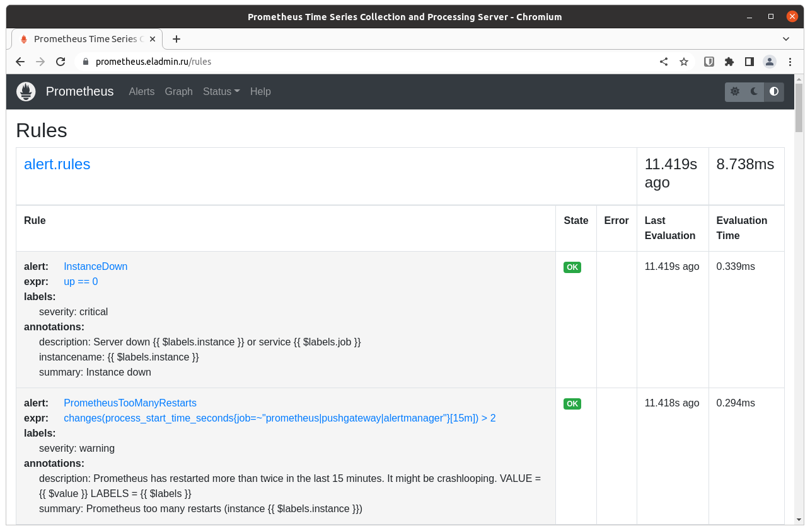
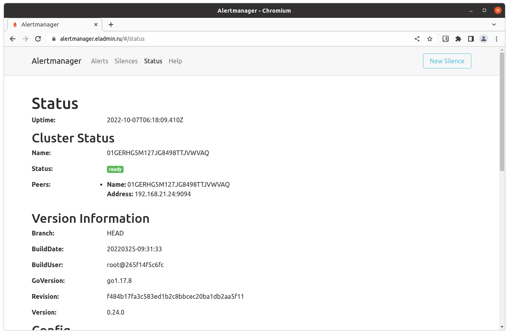

### Дипломный практикум в YandexCloud

### [Полное Задание](TASK.md)

#### Цели:

Зарегистрировать доменное имя (любое на ваш выбор в любой доменной зоне).

Подготовить инфраструктуру с помощью Terraform на базе облачного провайдера YandexCloud.

Настроить внешний Reverse Proxy на основе Nginx и LetsEncrypt.

Настроить кластер MySQL.

Установить WordPress.

Развернуть Gitlab CE и Gitlab Runner.

Настроить CI/CD для автоматического развёртывания приложения.

Настроить мониторинг инфраструктуры с помощью стека: Prometheus, Alert Manager и Grafana.

### Введение

Для решения поставленных задач...

Выбран подход с хранением переменных в terraform...

[variables.tf](./terraform/variables.tf)

secrets.tf - не загружается в репозиторий

Запуск ansible из terraform...

[ansible.tf](./terraform/ansible.tf)

[ansible.cfg](./terraform/ansible.cfg)

Дистрибутив ОС Linux Ubuntu 20.04 LTS потому что... 

### Этапы выполнения:

### 1. Регистрация доменного имени

#### Цель:

Получить возможность выписывать TLS сертификаты для веб-сервера.  

#### Ожидаемые результаты:

У вас есть доступ к личному кабинету на сайте регистратора.

Вы зарезистрировали домен и можете им управлять (редактировать dns записи в рамках этого домена).

---

#### Решение

Зарегистрировано доменное имя:

#### `eladmin.ru`

Доступ к личному кабинету регистратора есть.

Регистратор:

https://reg.ru

1. Зарегистрироваться на Yandex Cloud, привязать платежную карту. Результат - `cloud_id`
2. Установить утилиту для работы в cli. https://cloud.yandex.ru/docs/cli/quickstart
3. Создать папку для инфраструктуры - создана папка netology. Результат - `folder_id`

Зона DNS делегирована от регистратора к Yandex Cloud для автоматического создания записей при работе terraform.

https://cloud.yandex.ru/docs/dns/operations/zone-create-public

Создание и удаление записей в DNS зоне делается из terraform. По условиям задания это A записи.

[dnszone.tf](./terraform/dnszone.tf)

Ожидаемый результат достигнут.

---

### 2. Создание инфраструктуры  

Для начала необходимо подготовить инфраструктуру в YC при помощи Terraform.

#### Цель:

Повсеместно применять IaaC подход при организации (эксплуатации) инфраструктуры.  

Иметь возможность быстро создавать (а также удалять) виртуальные машины и сети. С целью экономии денег на вашем аккаунте в YandexCloud.  

#### Ожидаемые результаты:

Terraform сконфигурирован и создание инфраструктуры посредством Terraform возможно без дополнительных ручных действий.

---

#### Решение

Версия terraform

```commandline
$ terraform --version
Terraform v1.3.0
on linux_amd64
```

Настройки провайдера Yandex Cloud находятся в файлах
- [provider.tf](./terraform/provider.tf)
- `key.json` - файл не загружается в репозиторий

Для корректной работы кода необходимо:
 
4. В папке создать сервисный аккаунт с ролью `editor`. https://cloud.yandex.ru/docs/iam/operations/sa/create
5. Создать статический ключ доступа для сервисного аккаунта. Это необходимо для доступа terraform к S3 бакету. Ключ сохраняется в переменных окружания `AWS_ACCESS_KEY_ID = key_id` и `AWS_SECRET_ACCESS_KEY = secret` для постоянного хранения переменных окружения можно использовать файл `~/.bashrc` https://cloud.yandex.ru/docs/iam/operations/sa/create-access-key
6. Создать авторизированный ключ для сервисного аккаунта в файле `key.json` - он используется для доступа terraform к API Yandex Cloud при работе с инфраструктурой. https://cloud.yandex.ru/docs/iam/operations/authorized-key/create
7. Создать Object Storage, он же S3 бакет. Размер можно самый минимальный, установлен 1 Гб. Результат в настройке бакета - bucket

Делаем

```commandline
terraform init
terraform workspace new prod
terraform workspace new stage
terraform workspace select stage
```

Скачиваются необходимые провайдеры terraform и файл состояния terraform хранится в бакете.

Создаются workspaces stage и prod

Дальнейшая работа будет использовать workspace stage. Использование workspace prod занесем в [TODO](./TODO.md)

Сетевая инфраструктура описана в файле [network.tf](./terraform/network.tf)

Возможно создание VPC в разных зонах доступности.

Terraform сконфигурирован и создание инфраструктуры посредством Terraform возможно без дополнительных ручных действий.

Ожидаемый результат достигнут.

---

### 3. Установка Nginx и LetsEncrypt

#### Рекомендации:

• Имя сервера: `nginx.eladmin.ru`  

• Характеристики: 2vCPU, 2 RAM, External address (Public) и Internal address.

#### Цель:

Создать reverse proxy с поддержкой TLS для обеспечения безопасного доступа к веб-сервисам по HTTPS.  

#### Ожидаемые результаты:

В вашей доменной зоне настроены все A-записи на внешний адрес этого сервера:

https://www.eladmin.ru (WordPress)

https://gitlab.eladmin.ru (Gitlab)

https://grafana.eladmin.ru (Grafana)

https://prometheus.eladmin.ru (Prometheus)

https://alertmanager.eladmin.ru (Alert Manager)

Настроены все upstream для выше указанных URL, куда они сейчас ведут на этом шаге не важно, позже вы их отредактируете и укажите верные значения.

---

#### Решение

Так как сервер NGINX является единственным сервером в инфраструктуре с внешним адресом в интернете он должен решать следующие задачи:

1. Обратный прокси к сервисам, запущенным на серверах без внешнего адреса.
2. Для прокси генерируются TLS сертификаты Let’s Encrypt. Включен редирект http на https для всех конфигураций NGINX. Обмен во внутренней инфраструктуре по http.
3. Межсетевой экран с функцией PAT и DNAT для доступа серверов из внутренней сети в интернет и для доступа из интернета к внутренним сервисам, которые нельзя пропустить через NGINX. Например, ssh к Gitlab для работы git.
4. Данный сервер будет промежуточным ssh хостом для доступа во внутреннюю инфраструктуру. Поэтому на нем генерируются и распространяется по всей инфраструктуре ssh ключ.

Создание сервера `nginx.eladmin.ru` описано в [node_proxy.tf](./terraform/node_proxy.tf)

Настройка сервера `nginx.eladmin.ru` в [ansible_proxy.tf](./terraform/ansible_proxy.tf)

Запуск ansible из terraform по мере готовности ресурсов.

Ожидаемый результат достигнут.

---

### 4. Установка кластера MySQL

Необходимо разработать Ansible роль для установки кластера MySQL.

#### Рекомендации:

• Имена серверов: `db01.eladmin.ru` и `db02.eladmin.ru`

• Характеристики: 4vCPU, 4 RAM, Internal address.

#### Цель:

Получить отказоустойчивый кластер баз данных MySQL.

#### Ожидаемые результаты:

MySQL работает в режиме репликации Master/Slave.  

В кластере автоматически создаётся база данных c именем `wordpress`.  

В кластере автоматически создаётся пользователь `wordpress` с полными правами на базу `wordpress` и паролем `wordpress`.  

---

#### Решение

Создание серверов `db01.eladmin.ru` и `db02.eladmin.ru` описано в [node_mysql.tf](./terraform/node_mysql.tf)

Настройка серверов `db01.eladmin.ru` и `db02.eladmin.ru` в [ansible_mysql.tf](./terraform/ansible_mysql.tf)

Запуск ansible из terraform по мере готовности ресурсов.

Ожидаемый результат достигнут.

---

### 5. Установка WordPress

Необходимо разработать Ansible роль для установки WordPress.

#### Рекомендации:

• Имя сервера: `app.eladmin.ru`

• Характеристики: 4vCPU, 4 RAM, Internal address.

#### Цель:

Установить WordPress. Это система управления содержимым сайта (CMS) с открытым исходным кодом.  


#### Ожидаемые результаты:

Виртуальная машина на которой установлен WordPress и Nginx/Apache (на ваше усмотрение).  

В вашей доменной зоне настроена A-запись на внешний адрес reverse proxy:

https://www.eladmin.ru (WordPress)

На сервере `eladmin.ru` отредактирован upstream для выше указанного URL и он смотрит на виртуальную машину на которой установлен WordPress.  

В браузере можно открыть URL https://www.eladmin.ru и увидеть главную страницу WordPress.

---

#### Решение

Создание сервера WordPress `app.eladmin.ru` описано в [node_app.tf](./terraform/node_app.tf)

Настройка сервера WordPress `app.eladmin.ru` в [ansible_app.tf](./terraform/ansible_app.tf)

Запуск ansible из terraform по мере готовности ресурсов.

Ожидаемый результат достигнут.

---

### 6. Установка Gitlab CE и Gitlab Runner

Необходимо настроить CI/CD систему для автоматического развертывания приложения при изменении кода.

#### Рекомендации:

• Имена серверов: `gitlab.eladmin.ru` и `runner.eladmin.ru`  

• Характеристики: 4vCPU, 4 RAM, Internal address.

#### Цель:

Построить pipeline доставки кода в среду эксплуатации, то есть настроить автоматический деплой на сервер app.eladmin.ru при коммите в репозиторий с WordPress.  

#### Ожидаемый результат:

Интерфейс Gitlab доступен по https.  

В вашей доменной зоне настроена A-запись на внешний адрес reverse proxy:

https://gitlab.eladmin.ru (Gitlab)

На сервере `eladmin.ru` отредактирован upstream для выше указанного URL и он смотрит на виртуальную машину на которой установлен Gitlab.  

При любом коммите в репозиторий с WordPress и создании тега (например, v1.0.0) происходит деплой на виртуальную машину.

---

#### Решение

Создание сервера GitLab CE `gitlab.eladmin.ru` описано в [node_gitlab.tf](./terraform/node_gitlab.tf)

Настройка сервера GitLab CE `gitlab.eladmin.ru` в [ansible_gitlab.tf](./terraform/ansible_gitlab.tf)

Создание сервера GitLab runner `runner.eladmin.ru` описано в [node_runner.tf](./terraform/node_runner.tf)

Настройка сервера GitLab runner `runner.eladmin.ru` в [ansible_runner.tf](./terraform/ansible_runner.tf)

Запуск ansible из terraform по мере готовности ресурсов.

Ожидаемый результат достигнут.

---

### 7. Установка Prometheus, Alert Manager, Node Exporter и Grafana

Необходимо разработать Ansible роль для установки Prometheus, Alert Manager и Grafana.

#### Рекомендации:

• Имя сервера: `monitoring.eladmin.ru`  

• Характеристики: 4vCPU, 4 RAM, Internal address.

#### Цель:

Получение метрик со всей инфраструктуры.

#### Ожидаемые результаты:

Интерфейсы Prometheus, Alert Manager и Grafana доступены по https.  

В вашей доменной зоне настроены A-записи на внешний адрес reverse proxy:

• https://grafana.eladmin.ru (Grafana)

• https://prometheus.eladmin.ru (Prometheus)

• https://alertmanager.eladmin.ru (Alert Manager)

На сервере `eladmin.ru` отредактированы upstreams для выше указанных URL и они смотрят на виртуальную машину на которой установлены Prometheus, Alert Manager и Grafana.  

На всех серверах установлен Node Exporter и его метрики доступны Prometheus.  

У Alert Manager есть необходимый набор правил для создания алертов.  

В Grafana есть дашборд отображающий метрики из Node Exporter по всем серверам.  

В Grafana есть дашборд отображающий метрики из MySQL (*).

В Grafana есть дашборд отображающий метрики из WordPress (*).

Примечание: дашборды со звёздочкой являются опциональными заданиями повышенной сложности их выполнение желательно, но не обязательно.

---

#### Решение

Создание сервера `monitoring.eladmin.ru` описано в [node_monitoring.tf](./terraform/node_monitoring.tf)

Настройка сервера `monitoring.eladmin.ru` в [ansible_monitoring.tf](./terraform/ansible_monitoring.tf)

Запуск ansible из terraform по мере готовности ресурсов.

Задания со звездочками не выполнены и помещены в [TODO](./TODO.md)

Ожидаемый результат достигнут.

---

### Что необходимо для сдачи задания?

Репозиторий со всеми Terraform манифестами и готовность продемонстрировать создание всех ресурсов с нуля.

Репозиторий со всеми Ansible ролями и готовность продемонстрировать установку всех сервисов с нуля.

Скриншоты веб-интерфейсов всех сервисов работающих по HTTPS на вашем доменном имени.

https://www.eladmin.ru (WordPress)

https://gitlab.eladmin.ru (Gitlab)

https://grafana.eladmin.ru (Grafana)

https://prometheus.eladmin.ru (Prometheus)

https://alertmanager.eladmin.ru (Alert Manager)

Все репозитории рекомендуется хранить на одном из ресурсов (github.com или gitlab.com).

---

#### Решение

[Репозитарий с terraform и ansible](https://github.com/malzew/devops-diplom)

[Репозитарий с подготовленным кодом wordpress](https://github.com/malzew/wordpress)

Ожидаемый результат достигнут.

Скриншоты

https://www.eladmin.ru (WordPress)


https://gitlab.eladmin.ru (Gitlab)


https://grafana.eladmin.ru (Grafana)


https://prometheus.eladmin.ru (Prometheus)




https://alertmanager.eladmin.ru (Alert Manager)




---